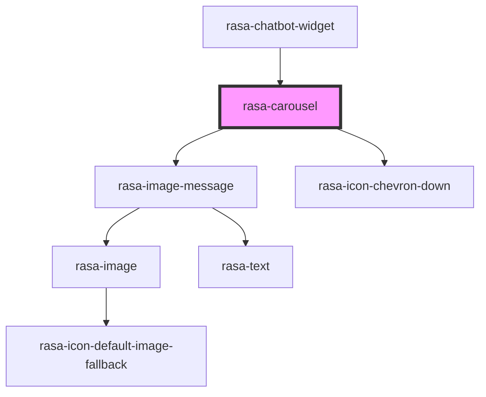

# rasa-carousel

<!-- Auto Generated Below -->

## Properties

| Property    | Attribute    | Description                                            | Type                | Default     |
| ----------- | ------------ | ------------------------------------------------------ | ------------------- | ----------- |
| `elements`  | --           | List of carousel elements                              | `CarouselElement[]` | `undefined` |
| `utterType` | `utter-type` | Optional visual variant derived from response metadata | `string`            | `undefined` |

## Events

| Event         | Description          | Type                     |
| ------------- | -------------------- | ------------------------ |
| `linkClicked` | User clicked on link | `CustomEvent<undefined>` |

## Dependencies

### Used by

 - [rasa-chatbot-widget](../../rasa-chatbot-widget)

### Depends on

- [rasa-image-message](../image-message)
- rasa-icon-chevron-down

### Graph

----------------------------------------------

*Built with [StencilJS](https://stenciljs.com/)*
