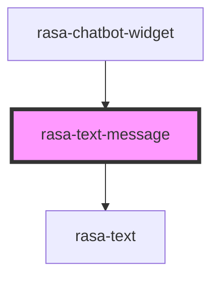

# rasa-text-message

<!-- Auto Generated Below -->

## Properties

| Property    | Attribute    | Description                                            | Type              | Default     |
| ----------- | ------------ | ------------------------------------------------------ | ----------------- | ----------- |
| `isHistory` | `is-history` | Is message form history                                | `boolean`         | `false`     |
| `sender`    | `sender`     | Who sent the message                                   | `"bot" \| "user"` | `undefined` |
| `utterType` | `utter-type` | Optional visual variant derived from response metadata | `string`          | `undefined` |
| `value`     | `value`      | Message value                                          | `string`          | `undefined` |

## Dependencies

### Used by

 - [rasa-chatbot-widget](../../rasa-chatbot-widget)

### Depends on

- [rasa-text](../text)

### Graph

----------------------------------------------

*Built with [StencilJS](https://stenciljs.com/)*
